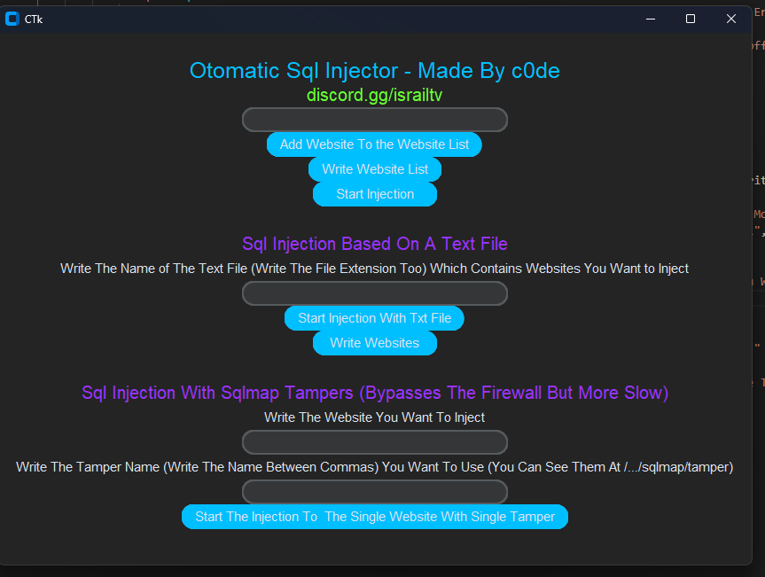

# OtoSqlmap
A Tool Which Is Designed to Make Sqlmap Tool Faster and Usable

!WARNING!
This Tool Just Made For Educational Purposes, Your IP Can Be Visible.

How To Use:
- First Start File "installation.cpp" With Commands:
  ```sh
  gcc insallation.cpp -o installation.exe
  installation.exe
  ```
- After The Installation Has Completed You Can Start Using The Tool With Start File "OtoSqlmap.py"

